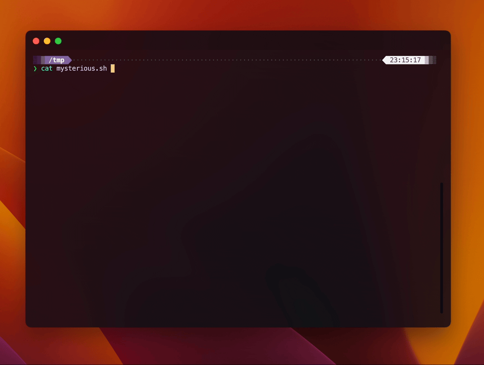
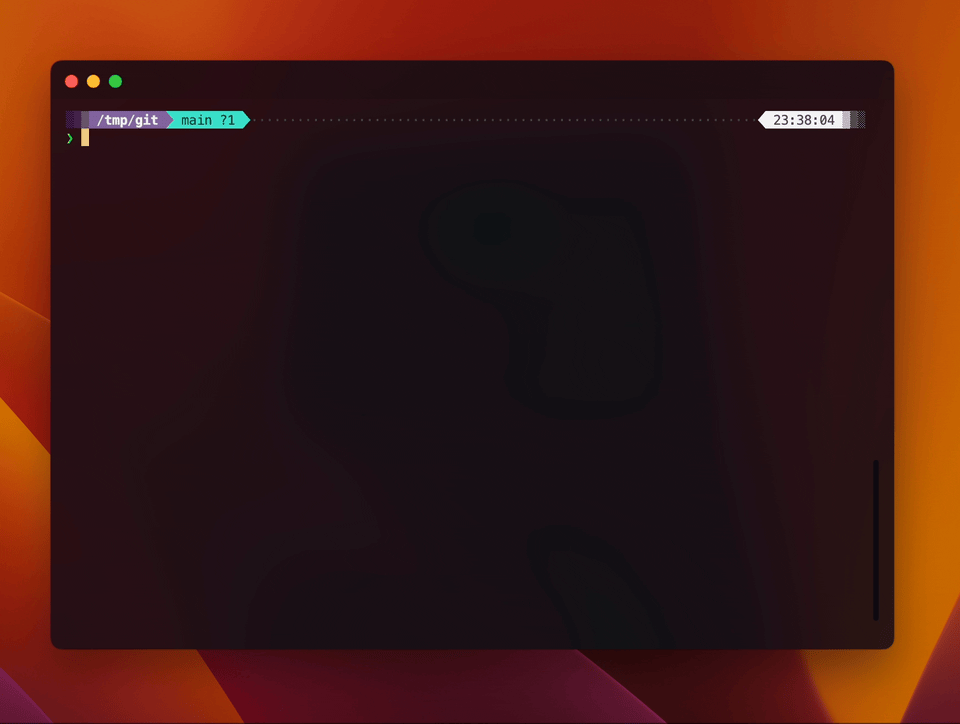
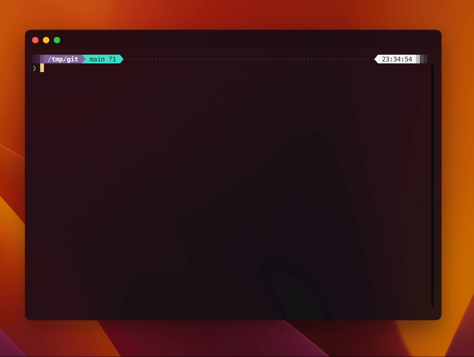

<h1 align="center">
hey,
</h1>
<h3 align="center">Run shell commands using natural language</h3>
<p align="center">
  <a href="#" target="_blank">
    
  </a>
</p>
<p align="center">
  ·
  <a href="https://github.com/TimoBechtel/hey,/issues">Report Bug / Request Feature</a>
  ·
</p>
<p align="center">

</p>

## Table of Contents

- [About](#about)
- [Installation](#install)
- [Setup](#setup)
- [Usage](#usage)
  - [`hey, run`](#hey-run)
  - [`hey, explain`](#hey-explain)
- [Data sent to providers](#data-sent-to-providers)
- [Migration to v2](#migration-to-v2)
- [More examples](#more-examples)
- [Contributing](#contributing)

## About

Use natural language to turn tasks into shell commands.

Just say what you want to do and `hey,` will generate the command for you.

### Features

- use natural language to run shell commands
- explain files, scripts, and piped input with your configured model
- caches successful commands to speed up future runs

### Why?

Shell scripts are powerful, but only if you remember the exact commands. `hey,` is for the moments when you know what you want, but not the syntax.

Always forget the command to pack a directory into a tarball? Just say it:

```sh
hey, create a tarball with all files in the current directory, except javascript files
```

## Install

### Binary install

```sh
curl -fsSL https://raw.githubusercontent.com/TimoBechtel/hey-comma/main/install.sh | bash
```

Supported binaries:

- macOS arm64
- macOS x64
- Linux x64
- Windows x64

### npm install

```sh
npm i -g hey-comma
```

> [!NOTE]
> `pnpm` does not like the comma, so only the `hey` alias is available. You can add it manually: `alias hey,=hey`

## Setup

### AI provider setup

`hey,` works with `openai`, `anthropic`, `google`, and `openrouter`.

Then, run:

```sh
hey, setup
```

and follow the prompts. This creates `~/.hey-comma/config.toml`.

If you prefer environment variables, set the key and point config to it:

```sh
export OPENROUTER_API_KEY=...
hey, config set openrouter_api_key "env:OPENROUTER_API_KEY"
```

## Usage

`hey,` currently has two modes: `run` and `explain`. Most of the time you don't need to specify the mode specifically, as `hey,` will automatically detect the mode based on whether you pipe data to it or not.

<p align="center">

</p>

### `hey, run`

`hey, run` is the default mode. It will convert your instruction to a shell command and run it. **It will always ask for confirmation before running the command.**

```sh
hey, create a tarball with all files in the current dir, except js files
```

You can explicitly specify the mode:

```sh
hey, run: initialize a next.js project in ./my-app
```

_(colon is optional)_

### `hey, explain`

`hey, explain` will explain the data you pipe to it.

> [!IMPORTANT]
> Piped data is sent to your configured provider. Do not pipe secrets you would not send to that service.

```sh
cat mysterious.sh | hey, is this safe to run
```

You can explicitly specify the mode:

```sh
cat script.sh | hey, explain: what does this do
```

_(colon is optional)_

### Special characters

To pass special characters to the `hey,`, you can pass them as a quoted string:

```sh
hey, "what is the most recent file in ~/Documents?"
```

## Configuration

You can configure `hey,` using the `hey, config` command. Or by editing the `config.toml` directly. To get the path to the config file, run:

```sh
hey, config path
```

For example, `~/.hey-comma/config.toml`

Available options:

- `default_provider`: default provider (`openai`, `anthropic`, `google`, `openrouter`)
- `default_model`: default model name for your default provider
- `model_aliases`: alias map for model selectors (e.g. `smart = "anthropic/claude-sonnet-4-5"`)
- `openai_api_key`: OpenAI API key (or `env:OPENAI_API_KEY`)
- `anthropic_api_key`: Anthropic API key (or `env:ANTHROPIC_API_KEY`)
- `google_api_key`: Google API key (or `env:GOOGLE_API_KEY`)
- `openrouter_api_key`: OpenRouter API key (or `env:OPENROUTER_API_KEY`)
- `openrouter_base_url`: OpenRouter base URL (default: `https://openrouter.ai/api/v1`)
- `disable_thinking`: disable provider reasoning/thinking modes where supported (default: `false`)
- `temperature`: the temperature to use when generating commands (default: `0.2`)
- `max_tokens`: the maximum number of tokens to generate (default: `1200`)
- `run_prompt`: the prompt to use when generating commands (see [Custom prompts](#custom-prompts))
- `explain_prompt`: the prompt to use when explaining data (see [Custom prompts](#custom-prompts))
- `cache.max_entries`: the maximum number of entries to cache (default: `50`)

### Model selector

Use `--model` when you want to override your defaults:

```sh
hey, run --model anthropic/claude-sonnet-4-5 "create a tarball from this folder"
hey, explain --model openrouter/openai/gpt-4o "what does this script do?"
```

Accepted forms:

- full selector: `<provider>/<model>`
- alias from `model_aliases`
- bare model name (resolved with `default_provider`)

Example aliases:

```toml
[model_aliases]
fast = "openai/gpt-4o-mini"
smart = "anthropic/claude-sonnet-4-5"
cheap = "google/gemini-2.5-flash"
```

### Custom prompts

You can customize the prompts used by `hey,` by setting the `run_prompt` and `explain_prompt` options. See [prompts.ts](https://github.com/TimoBechtel/hey-comma/blob/main/src/prompts.ts) for the default prompts.

> [!IMPORTANT]
> Make sure to add the placeholders (e.g. `%INSTRUCTION%`) to your custom prompts.

The following placeholders are available:

- `%INSTRUCTION%`: the instruction that is passed to `hey, run` or `hey, explain`
- `%SHELL%`: the current shell (e.g. `bash` or `zsh`) (only available for `hey, run`)
- `%INPUT%`: the data that is piped to `hey, explain` (only available for `hey, explain`)

## Data sent to providers

`hey,` sends this data to your configured provider:

- The command you want to run
- The data you pipe to `hey, explain`
- Your current shell (e.g. `bash` or `zsh`)

## Migration to v2

v2 is intentionally breaking. There is no compatibility layer for old flags or old config keys.

Removed:

- `--gpt4`
- `openai_model`
- OpenAI-only runtime behavior

Use this instead:

- `--model <provider/model>` (or alias / bare model with default provider)
- `default_provider`, `default_model`, and `[model_aliases]` in config

## More usage examples

<p align="center">

</p>

```sh
hey, what are the largest files in my download directory
```

```sh
cat salaries.csv | hey, what is the average salary of people with a PhD
```

```sh
cat script.sh | hey, explain
```

## Contributing

### Development

This project uses [bun](https://bun.sh/) as package manager and compiler.

If you don't have bun installed, run:

```sh
curl -fsSL https://bun.sh/install | bash
```

#### Install dependencies

```sh
bun install
```

#### Build

```sh
bun run build
```

To build all release binaries:

```sh
bun run build:all
```

### Commit messages

This project uses semantic-release for automated release versions. So commits in this project follow the [Conventional Commits](https://www.conventionalcommits.org/en/v1.0.0-beta.2/) guidelines. I recommend using [commitizen](https://github.com/commitizen/cz-cli) for automated commit messages.

### Release publishing

`main` releases use semantic-release with npm Trusted Publishing (OIDC).  
Before publishing, configure `TimoBechtel/hey-comma` as a trusted publisher in npm package settings.
